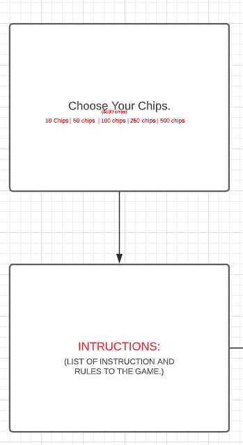

# Game Project
---
## Description
This is a gambling game that will be a street dice game that can be played individually.

---
## Technology used:
- HTML
- CSS
- Javascript
- Bootstrap(maybe)

---
## User Story:
- User will be able to choose the amount of chips they would like to gamble with
- User will have access to instructions to play the game
- User can choose how much of their chips they are willing to wager with each time
- pressing roll, rolls the dice randomly 
- user can either win the the equivalent of what they wagered or lose what they wagered
- if the first roll is 7 or 11 then you win money
- if the first roll is a 2, 3, 12 then you lose money
- if the first roll is anythng else then that is your point  and you roll again until you roll your point again
- if a 7 or 11 is rolled before the point then you lose
- if the player runs out of money then the game is ended 

